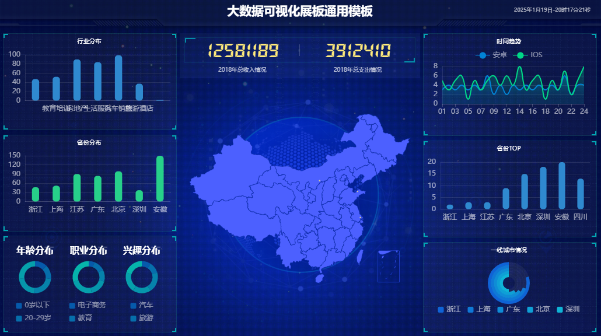

# 数据大屏可视化

随着云计算和大数据技术的不断发展，Amazon S3 已成为最受欢迎的对象存储解决方案。借助其高可扩展性和低成本特性，S3 作为数据湖的核心存储平台，支持各种大数据处理需求。本实验将重点介绍如何在 AWS 上创建 S3 表，并通过集成其他 AWS 服务实现数据存储、处理和分析。

通过本项目，您将学习如何使用 Spark 进行 S3 表存储桶 内数据表的数据操作，实现数据的大屏展示。

# 功能

基于Amazon S3 Table 数据源实现数据大屏

# 安装 Flask、PySpark、boto3

```bash
pip install Flask
pip install pyspark==3.5.2
pip install boto3
```

# 运行

修改 `app.py` 的 `bucket_arn`，修改为我们的表存储桶的 `ARN`。

然后执行以下命令：

```
spark-submit \
  --packages org.apache.iceberg:iceberg-spark-runtime-3.5_2.12:1.6.1,software.amazon.s3tables:s3-tables-catalog-for-iceberg-runtime:0.1.4,software.amazon.s3tables:s3-tables-catalog-for-iceberg:0.1.4,org.apache.hadoop:hadoop-aws:3.3.1 \
  app.py
```

* 大数据可视化展板通用模板 http://127.0.0.1:5000/        

# 示例



