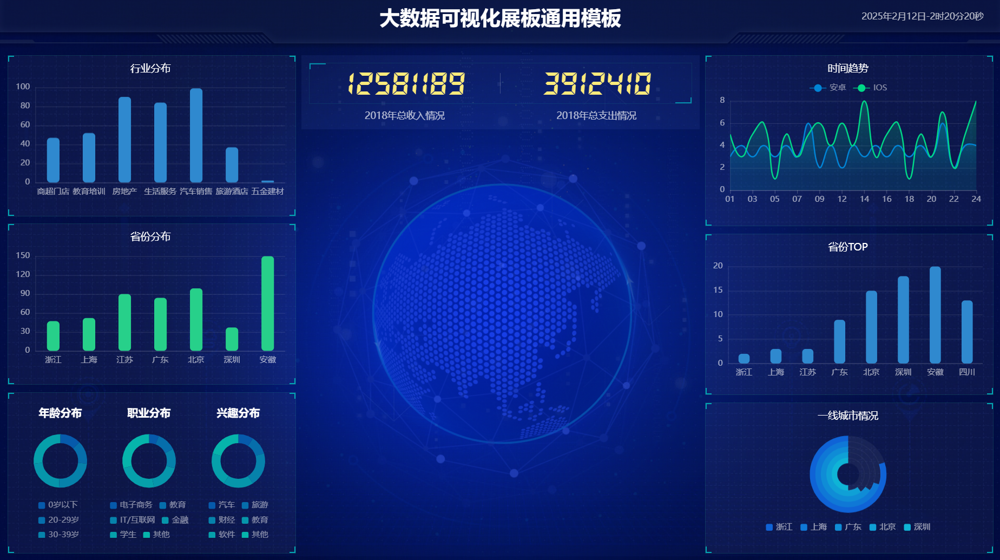

# big_screen
数据大屏可视化

# 功能

基于Amazon S3 Table 数据源实现数据大屏

# 安装 Flask、PySpark、boto3

```bash
pip install Flask
pip install pyspark==3.5.2
pip install boto3
```

# 运行

```
spark-submit \
  --packages org.apache.iceberg:iceberg-spark-runtime-3.5_2.12:1.6.1,software.amazon.s3tables:s3-tables-catalog-for-iceberg-runtime:0.1.4,software.amazon.s3tables:s3-tables-catalog-for-iceberg:0.1.4,org.apache.hadoop:hadoop-aws:3.3.1 \
  app.py
```

* 2018年居民消费分析数字化大屏 http://127.0.0.1:5000/        

# 示例



